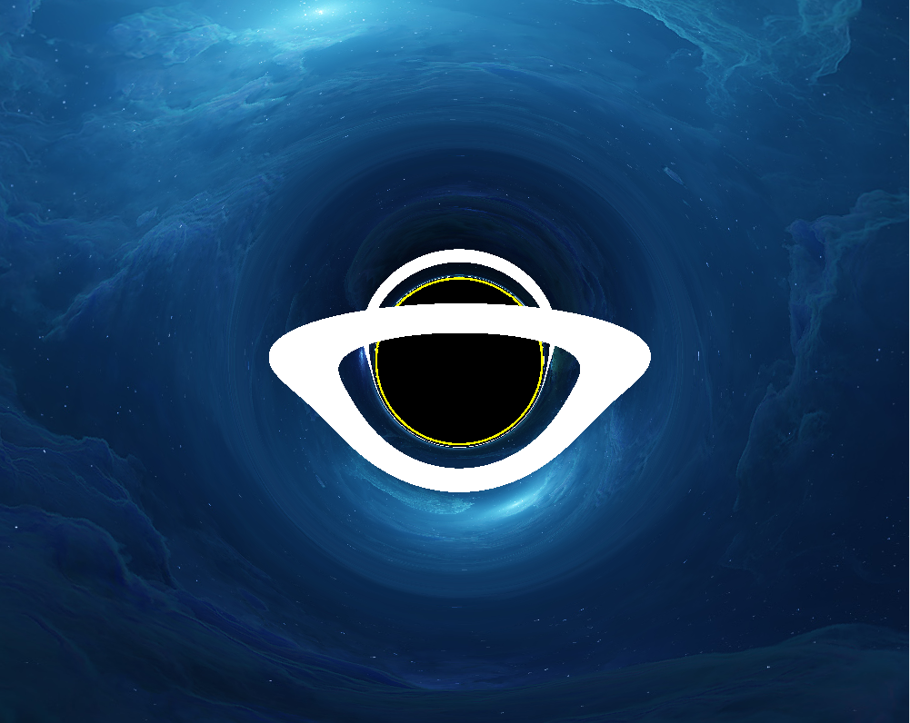

# Black Hole Ray Marching

git test

Using rust and WGPU (wgpu-rs), and wgsl shaders.

Use `cargo run` to start.

WASM support may be added.





I keep getting this error.
I know you have to align stuff.
I made stuff aligned to 16 bytes (or whetever it was) in the rust code and it worked on desktop.
But I didn't have to change the shaders.
Now I am running it in the browser and it shows this error.
I can fix this by replacing all the f32 uniforms and vec3<f32> uniforms with vec4<f32> uniforms and just accessing the required components.
There must be a beeter way to do this.
Does anyone know anything about this?
```
Caused by:
    In Device::create_render_pipeline
      note: label = `Render Pipeline`
    In the provided shader, the type given for group 1 binding 1 has a size of 4. As the device does not support `DownlevelFlags::BUFFER_BINDINGS_NOT_16_BYTE_ALIGNED`, the type must have a size that is a multiple of 16 bytes.
```
Also, the way I padd the uniforms in the rust code is having a struct for the uniform with some _padding which is the correct size. This also seesm like a bad way of doing things. Any ideas?


```
let camera_view_proj_buffer = device.create_buffer_init(&wgpu::util::BufferInitDescriptor {
    label: Some("camer view proj"),
    // contents: bytemuck::cast_slice(&[camera_view_proj_uniform]),
    contents: encase::UniformBuffer::new(camera_view_proj_uniform).into_inner(),
    usage: wgpu::BufferUsages::UNIFORM | wgpu::BufferUsages::COPY_DST,
});
```

so currently im doing this when i create the buffer
```
let mut buffer5 = encase::UniformBuffer::new(Vec::new());
buffer5.write(&camera_view_proj_uniform).unwrap();
let byte_buffer5 = buffer5.into_inner();

let camera_view_proj_buffer = device.create_buffer_init(&wgpu::util::BufferInitDescriptor {
    label: Some("camer view proj"),
    // contents: bytemuck::cast_slice(&[camera_view_proj_uniform]),
    contents: &byte_buffer5,
    usage: wgpu::BufferUsages::UNIFORM | wgpu::BufferUsages::COPY_DST,
});
```

and this when i write to the buffer
``` 
let mut buffer5 = encase::UniformBuffer::new(Vec::new());
buffer5.write(&self.camera_view_proj_uniform).unwrap();
let byte_buffer5 = buffer5.into_inner();

self.queue.write_buffer(
    &self.camera_view_proj_buffer,
    0,
    &byte_buffer5,
);
```

this 1000% does not look like the right way to do it

I've got this thing
```rs
struct OtherUniform<T>
where
    T: ShaderType,
{
    label: String,
    value: T,
    shader_stage: ShaderStages,
}

struct OtherUniforms<const N: usize> {
    positive_modifier_key_code: VirtualKeyCode,
    negative_modifier_key_code: VirtualKeyCode,
    other_uniforms: [Box<OtherUniform<dyn ShaderType>>; N],
}
```
and I'm getting this error
```rs
error[E0191]: the value of the associated type `ExtraMetadata` (from trait `ShaderType`) must be specified
   --> src/uniformscontroller.rs:312:43
    |
312 |     other_uniforms: [Box<OtherUniform<dyn ShaderType>>; N],
    |                                           ^^^^^^^^^^ help: specify the associated type: `ShaderType<ExtraMetadata = Type>`
```
And I can't find any info about this ExtraMetaData thing.
