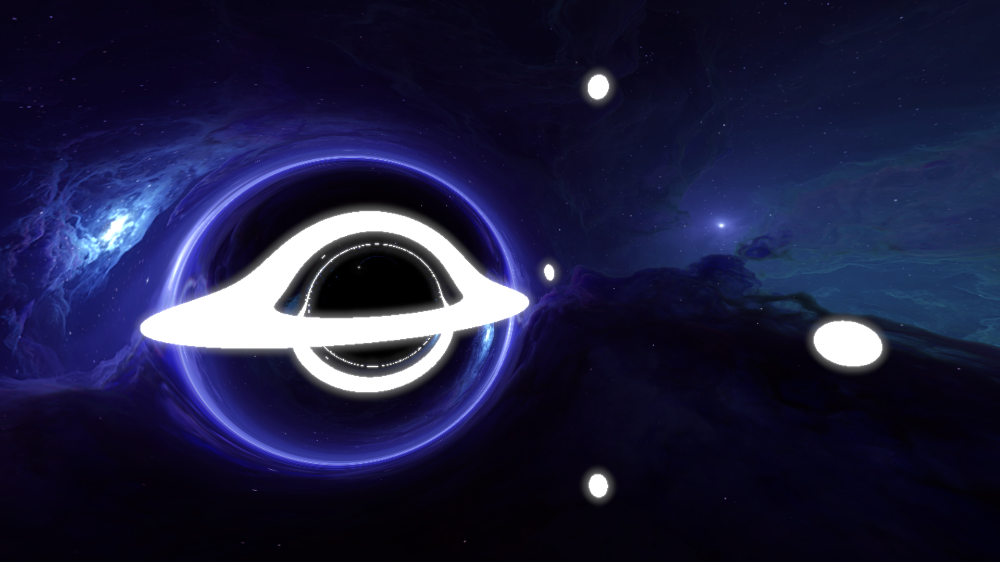

# Black Hole Ray Marching

Using rust and WGPU (wgpu-rs), and wgsl shaders. Supports WASM.

Use `cargo run` to start.

## Controls

- WASD, F and Space to move.
- Q and E to change speed.
- Press number keys and arrows to change shader uniforms.
- Hold F and the number keys to change maximum framerate.